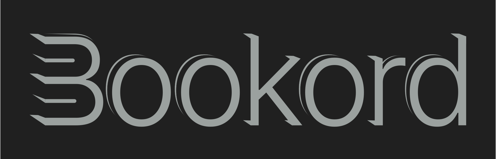

# Bookord

[](https://wakatime.com/badge/github/LiprikON2/Bookord)

[]()


&nbsp;&nbsp;&nbsp;&nbsp;&nbsp;&nbsp;&nbsp;&nbsp;&nbsp; 


&nbsp;&nbsp;&nbsp;&nbsp;&nbsp;&nbsp;&nbsp;&nbsp;&nbsp; [Demo Video - Library](https://www.youtube.com/watch?v=lXqP77dod8o) &nbsp;&nbsp;&nbsp;&nbsp;&nbsp;&nbsp;&nbsp;&nbsp;&nbsp; | &nbsp;&nbsp;&nbsp;&nbsp;&nbsp;&nbsp;&nbsp; [Demo Video - Reading](https://www.youtube.com/watch?v=95-NBEa5OIw) &nbsp;&nbsp;&nbsp;&nbsp;&nbsp;&nbsp;&nbsp; | &nbsp;&nbsp;&nbsp;&nbsp;&nbsp;&nbsp;&nbsp;&nbsp;&nbsp; [Demo Video - AI Recaps](https://www.youtube.com/watch?v=i9kWWFO5MVY)

<a href="http://www.youtube.com/watch?feature=player_embedded&v=lXqP77dod8o
" target="_blank"></a>
<a href="http://www.youtube.com/watch?feature=player_embedded&v=95-NBEa5OIw
" target="_blank"></a>
<a href="http://www.youtube.com/watch?feature=player_embedded&v=i9kWWFO5MVY
" target="_blank"></a>


<div style="width:300px;vertical-align:top;font-family: Arial;font-size:9pt;line-height: normal">
<a rel="license" href="//responsivevoice.org/"></a><span xmlns:dct="https://purl.org/dc/terms/" property="dct:title">&nbsp;<a href="//responsivevoice.org/" target="_blank" title="ResponsiveVoice Text To Speech">ResponsiveVoice</a></span> used under<br/>&nbsp;&nbsp;&nbsp;&nbsp;&nbsp;&nbsp;&nbsp;&nbsp;&nbsp;&nbsp;&nbsp;&nbsp;&nbsp;&nbsp;&nbsp;&nbsp;&nbsp;&nbsp;&nbsp;&nbsp;&nbsp;&nbsp;&nbsp;&nbsp;&nbsp;&nbsp;&nbsp;&nbsp;&nbsp; <a rel="license" href="https://creativecommons.org/licenses/by-nc-nd/4.0/" title="Creative Commons Attribution-NonCommercial-NoDerivatives 4.0 International License">Non-Commercial License</a></div>
<div style="clear:both;">&nbsp;</div>


> Based on [Electron React Webpack Typescript](https://github.com/codesbiome/electron-react-webpack-typescript-2024) template by @codesbiome


### Download
> Books are stored at `%APPDATA%/bookord/Books` (Windows)

[Download link](https://github.com/LiprikON2/bookord/releases/latest)


___


### Development


Install dependencies using [npm](https://www.npmjs.com/):

```bash
npm install
```

<br />

## Start : Development

To develop and run your application, you need to run following command.
<br />
Start electron application for development :

```bash
npm run dev
```

<br />


## Package : Production

Customize and package your Electron app with OS-specific bundles (.app, .exe etc)

```bash
npm run package
```

<br />

## Make : Production

Making is a way of taking your packaged application and making platform specific distributables like DMG, EXE, or Flatpak files (amongst others).

```bash
npm run make
```

<br />

## Publish : Production

Publishing is a way of taking the artifacts generated by the `make` command and sending them to a service somewhere for you to distribute or use as updates. (This could be your update server or an S3 bucket)

```bash
npm run publish
```

<br />

